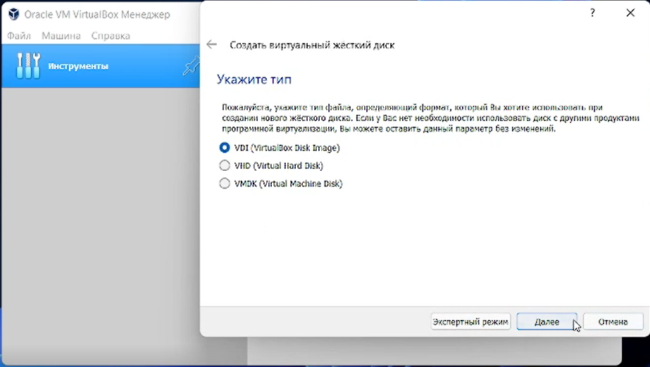
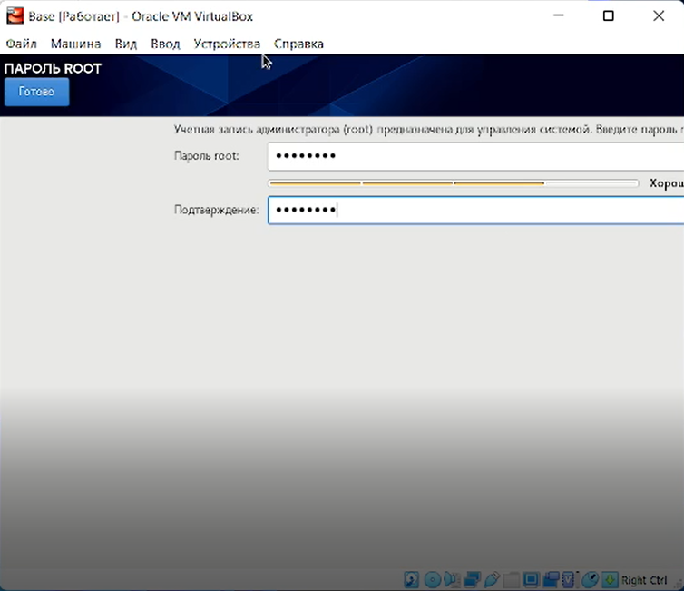
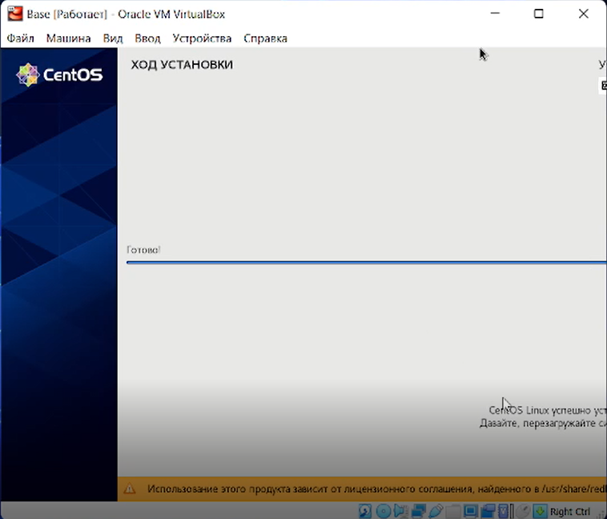

---
# Front matter
lang: ru-RU
title: "Отчёт по лабораторной работе 2"
subtitle: "дисциплина: Информационная безопасность"
author: "Абдуллаев Сайидазизхон Шухратович, НПИбд-02-18"

# Formatting
toc-title: "Содержание"
toc: true # Table of contents
toc_depth: 2
lof: true # List of figures
lot: true # List of tables
fontsize: 12pt
linestretch: 1.5
papersize: a4paper
documentclass: scrreprt
polyglossia-lang: russian
polyglossia-otherlangs: english
mainfont: PT Serif
romanfont: PT Serif
sansfont: PT Sans
monofont: PT Mono
mainfontoptions: Ligatures=TeX
romanfontoptions: Ligatures=TeX
sansfontoptions: Ligatures=TeX, Scale=MatchLowercase
monofontoptions: Scale=MatchLowercase
indent: true
pdf-engine: pdflatex
header-includes:
  - \linepenalty=10 # the penalty added to the badness of each line within a paragraph (no associated penalty node) Increasing the value makes tex try to have fewer lines in the paragraph.
  - \interlinepenalty=0 # value of the penalty (node) added after each line of a paragraph.
  - \hyphenpenalty=50 # the penalty for line breaking at an automatically inserted hyphen
  - \exhyphenpenalty=50 # the penalty for line breaking at an explicit hyphen
  - \binoppenalty=700 # the penalty for breaking a line at a binary operator
  - \relpenalty=500 # the penalty for breaking a line at a relation
  - \clubpenalty=150 # extra penalty for breaking after first line of a paragraph
  - \widowpenalty=150 # extra penalty for breaking before last line of a paragraph
  - \displaywidowpenalty=50 # extra penalty for breaking before last line before a display math
  - \brokenpenalty=100 # extra penalty for page breaking after a hyphenated line
  - \predisplaypenalty=10000 # penalty for breaking before a display
  - \postdisplaypenalty=0 # penalty for breaking after a display
  - \floatingpenalty = 20000 # penalty for splitting an insertion (can only be split footnote in standard LaTeX)
  - \raggedbottom # or \flushbottom
  - \usepackage{float} # keep figures where there are in the text
  - \usepackage{amsmath}
  - \floatplacement{figure}{H} # keep figures where there are in the text
---

# Цель работы

Приобретение практических навыков установки операционной системы на виртуальную машину, настройки минимально необходимых для дальнейшей работы сервисов.

# Задание

Установить на виртуальную машину VirtualBox операционную систему Linux, дистрибутив CentOs, а также настроить необходимые для работы сервисы.

# Ход работы

1. Запускаем VirtualBox. (Рис. -@fig:001).

{ #fig:001 width=73% }

2. Проверяем в свойствах VirtualBox месторасположение каталога для виртуальных машин. (Рис. -@fig:002).

{ #fig:002 width=73% }

3. Создаем новую виртуальную машину и указываем необходимые параметры. (Рис. -@fig:003, -@fig:004).

{ #fig:003 width=73% }

{ #fig:004 width=73% }

4. Задаем конфигурацию жёсткого диска, а также его расположение и размер. (Рис. -@fig:005, -@fig:006, -@fig:007, -@fig:008).

{ #fig:005 width=73% }

{ #fig:006 width=73% }

{ #fig:007 width=73% }

{ #fig:008 width=73% }

5. Проверяем местоположение папки для снимков виртуальной машины Base. (Рис. -@fig:009).

{ #fig:009 width=73% }

6. Выбираем образ оптического диска в окне "Носители". (Рис. -@fig:010).

{ #fig:010 width=73% }

7. Запускаем виртуальную машину Base и проводим конфигурацию параметров будущей ОС в соответствии с требованиями. (Рис. -@fig:011, -@fig:012, -@fig:013, -@fig:014, -@fig:015, -@fig:016, -@fig:017). 

 { #fig:011 width=73% }

 { #fig:012 width=73% }

 { #fig:013 width=73% }

 { #fig:014 width=73% }

 { #fig:015 width=73% }

 { #fig:016 width=73% }

 { #fig:017 width=73% }

 8. Задаем пароль на root права и создаем пользователя с правами администратора. (Рис. -@fig:018, -@fig:019).

 { #fig:018 width=73% }

 { #fig:019 width=73% }

 9. Завершаем установку систему и перезагружаем ее. (Рис. -@fig:020).

{ #fig:020 width=73% }

10. Запускаем виртуальную машину Base и настраиваем её. (Рис. -@fig:021, -@fig:022).

{ #fig:021 width=73% }

{ #fig:022 width=73% }

11. Подключаемся к виртуальной машине с помощью созданной учётной записи. (Рис. -@fig:023).

{ #fig:023 width=73% }

12. На виртуальной машине Base запускаем терминал и переходим под учетную
запись root с помощью команды su.(Рис. -@fig:024).

 { #fig:024 width=73% }

 13. С помощью команды yum update обновлем системные файлы и устанавливаем необходимые программы. (Рис. -@fig:025, -@fig:026).

 { #fig:025 width=73% }

14. Освобождаем «Base.dvi»,чтобы другие виртуальные машины могли использовать машину Base и её конфигурацию как базовую. (Рис. -@fig:027).

{ #fig:027 width=73% }

15. На основе виртуальной машины Base создаем машину Host2, выбрав в качестве диска существующий жёсткий диск. (Рис. -@fig:028, -@fig:029).

{ #fig:028 width=73% }

{ #fig:029 width=73% }

# Выводы

В результате выполнения данной работы были приобретены навыки установки операционной системы на виртуальную машину, а также настроены минимально необходимые для дальнейшей работы сервисы.